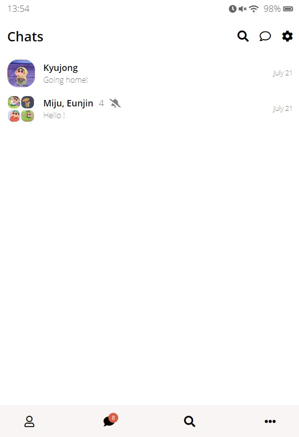
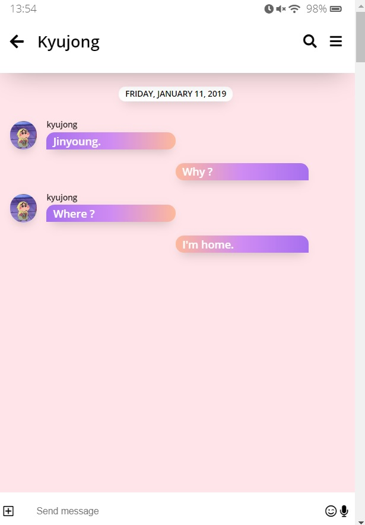
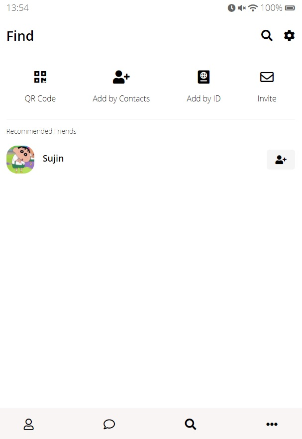
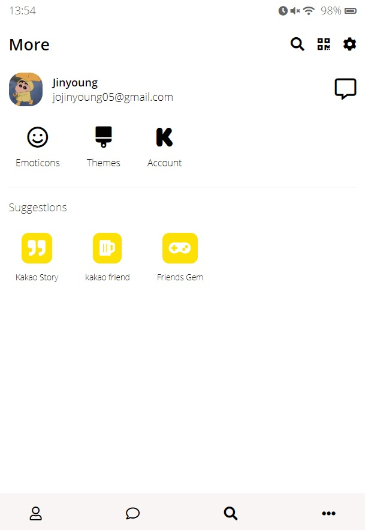
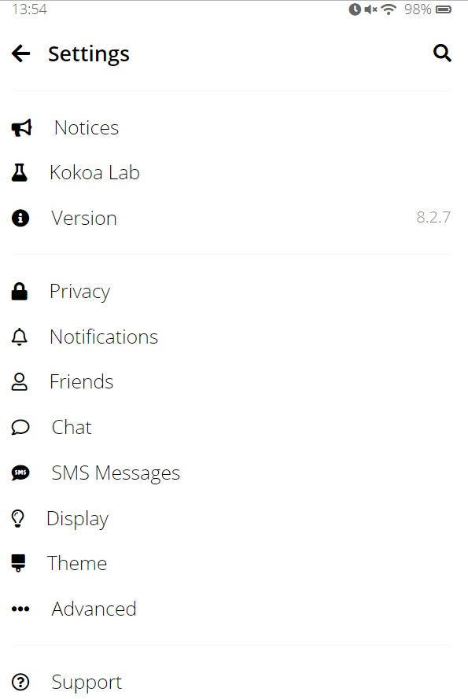
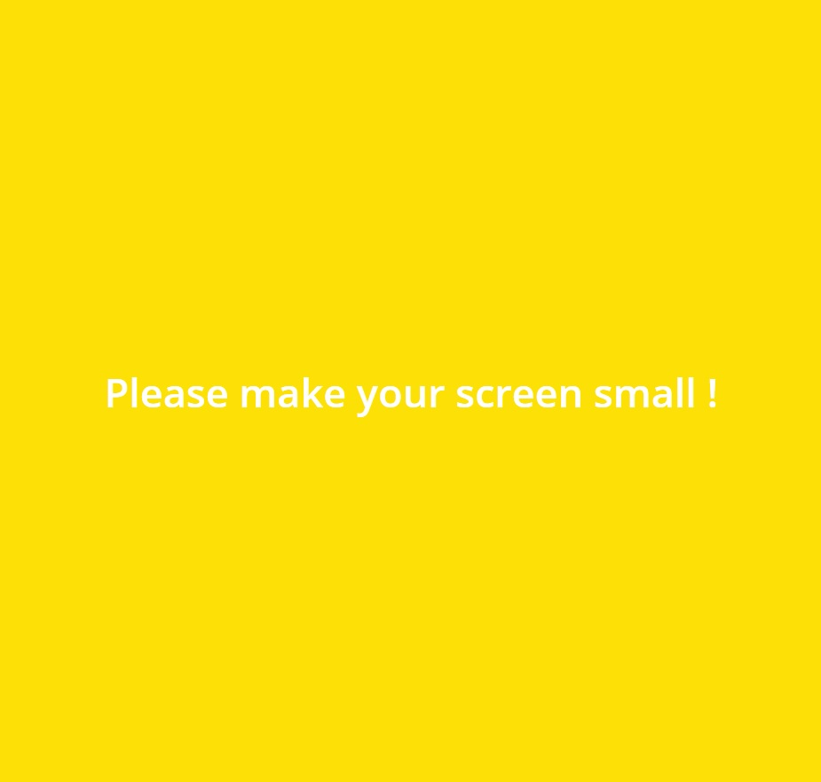

# Kakao-clone

## 구현 화면

##### 자세한 부분은 페이지 참조

[Kakao-clone 페이지](https://chjy0527.github.io/kakao-clone/)

### **index.html**

### **Chats.html**

### **Chat.html**

### **Find.html**

### **More.html**

### **Settings.html**

### **Mobile**

##### 지정해둔 최소 사이즈 보다 화면이 커지면 보이게 되는 화면

